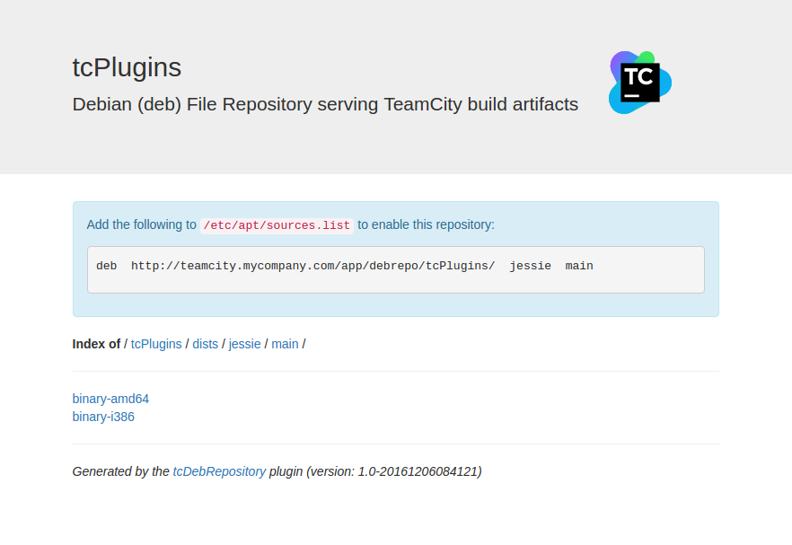

# tcDebRepository - A TeamCity plugin to serve package updates to Debian/Ubuntu servers 

tcDebRepository provides a Debian Package server from within TeamCity.

In the Debian Linux operating system (and derivatives like Ubuntu), software packages are installed by downloading them from a Debian Package Repository. The locations (URLs) of repositories are configured in `/etc/apt/sources.list` or a file named `something.list` placed in the `/etc/apt/sources.list.d/` directory. These entries will be referred to as "APT lines" because they are the configuration for the APT set of tools. These include, apt-get, aptitude, synaptic. The "APT Tools" hereafter will be referred to collectively as "APT".

A typical APT line entry looks like this:

	deb http://httpredir.debian.org/debian jessie main

This line is made up of the following space delimited tokens:

	deb URL dist component

- deb : Tells APT to use this configuration for binary DEB package files. deb-src is also used for downloading source code packages, although tcDebRepository does not currently support deb-src 
- URL : The base URL of the repository. APT expects a specific URL structure of which this is the root. For more details see <tcdebrepo-server/RepositoryNotes.md>.
- dist : The Debian distribution name. In the example above, `jessie` is the Debian distribution name.
- component : The component(s) that this repository serves. Typical values for component are: `main, stable, unstable, testing, experimental`.

##What tcDebRepository provides

1.  A browsable repository of packages and package meta-data.
2.  A repository in the structure consumed by APT including a URL from which APT can download the packages.  
3.  A processor which watches for build events and parses the list of artifacts, filters them and then publishes the package meta-data into matched repositories.
4.  A UI for creating, editing and removing repositories.
5.  A UI for creating, editing and removing the Artifact Filters that the processor uses for indexing packages.

### Creating a Debian Repository
The tcDebRepository plugin adds a new tab to the Edit Project screen entitled "Debian Repositories (1)" indicating how many repositories exist in the project. 

  

A list of Repositories are shown for the current project, and parent projects. A repository is aligned to a project, because that determines who has permission to edit the repository configuration (PROJECT_EDIT permission), and which builds are available to be added to a repository.  

New repositories can be created from this screen by clicking the *Add Repository* button. A link to edit any existing repositories is also available (if the user has permission). 

### Editing Artifact Filters in a Debian Repository
Once created, a repository needs to be configured with which builds to watch, and which artifacts to be filtered. This is done on the Edit Repository screen.

 

### Renaming or Deleting a repository
A repository can be renamed or reallocated to another project by clicking the *Edit repository...* link in the Actions menu.
Repository names __must__ be named uniquely across a TeamCity instance as they form part of the URL. Additionally, a repository name must only contain letters, numbers, underscores and hyphens. This is to avoid issues with URLs configured in the APT sources.list file. 

A repository can be deleted by clicking the *Delete repository...* link in the Actions menu. Deleting a repository removes the repository configuration and index. It does __not__ remove the actual TeamCity artifacts on disk.

 

### Browsing a Debian Repository

There are links on the Edit Repository pages, and the Debian Repositories page (in the breadcrumb of the Edit page) to browse a repository.  
  

 